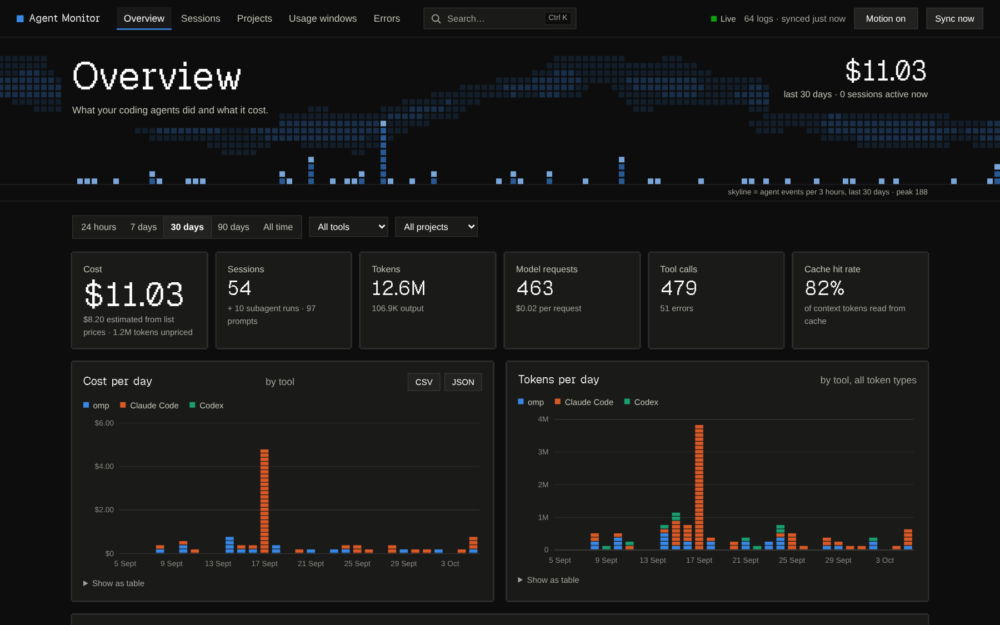
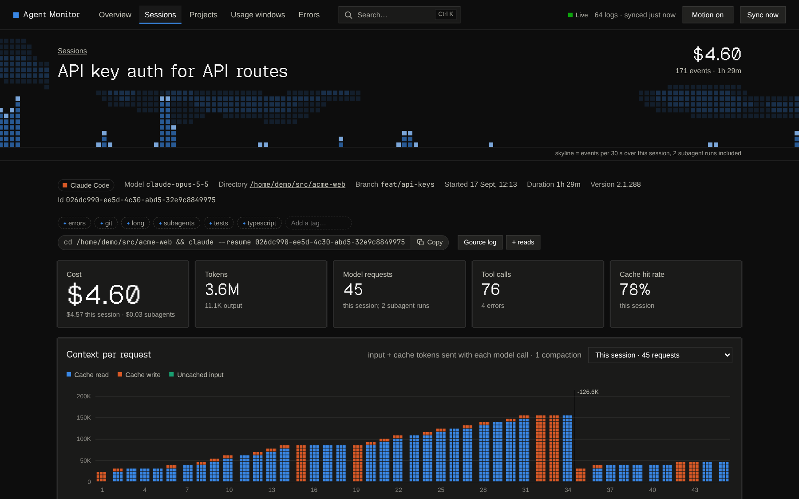
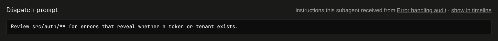
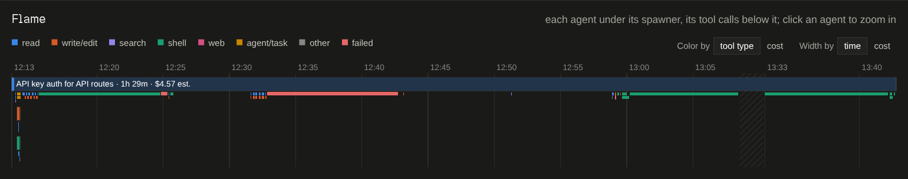
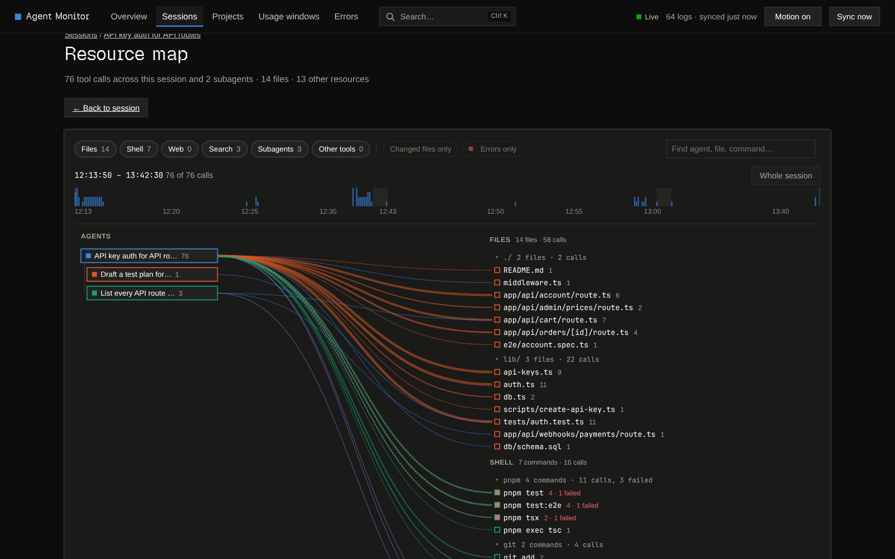
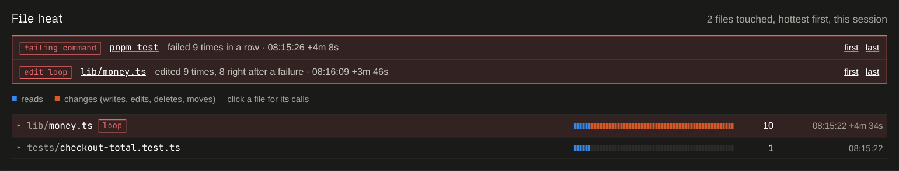
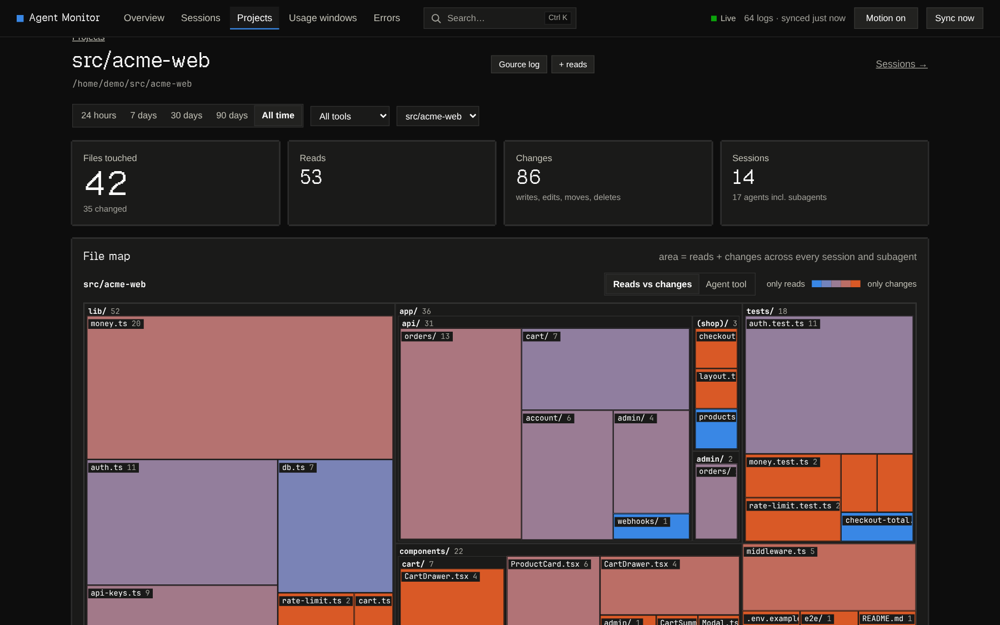
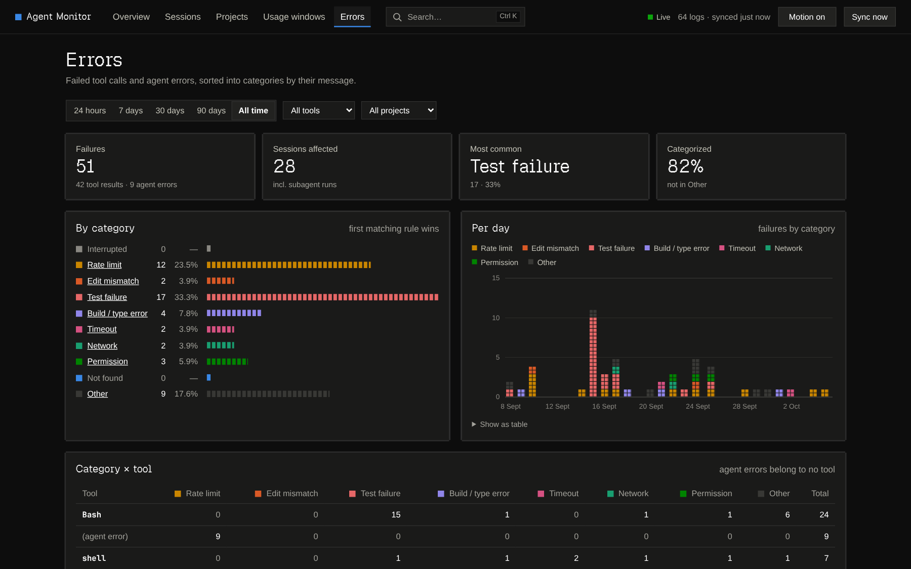
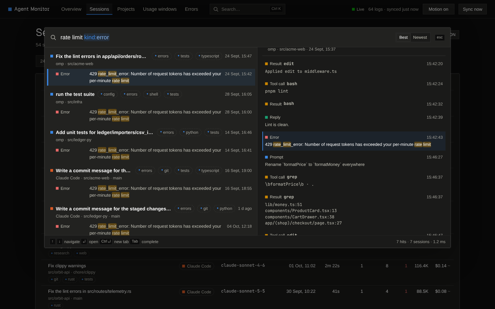
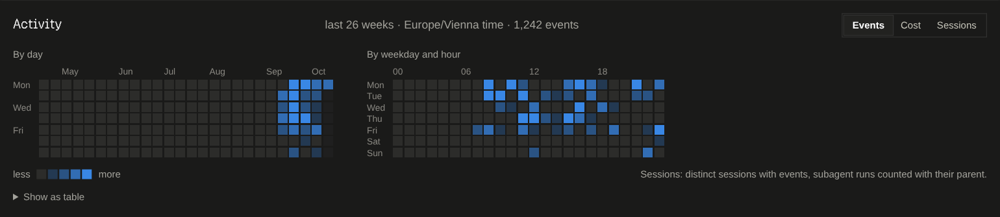

<div align="center">

# Agent Monitor

**See what your AI coding agents actually did.**<br>
A local dashboard for omp, Claude Code and Codex sessions: cost, timelines, subagents, the files and tools they touched, and full-text search over everything. It works from the logs the agents already write, with no hooks, proxies or cloud.

[](https://github.com/Manubown/agent-monitor/actions/workflows/ci.yml)
[](https://github.com/Manubown/agent-monitor/releases)
[](LICENSE)



</div>

> [!WARNING]
> **Alpha (`0.1.0-alpha.1`).** It works daily on real logs, but the UI, CLI and database schema will change. The database is a cache rebuilt from your logs, so upgrades are cheap; your tags are kept. [Feedback and bug reports](#feedback) shape what comes next.

All screenshots come from the bundled synthetic demo dataset (`pnpm demo`). None of it is real session data.

## Why

Coding agents now spawn subagents, run hundreds of tool calls and burn through context windows. Their transcripts record all of it, but as JSONL that nobody reads. Agent Monitor turns those logs into views that answer:

- **What did it do?** Which files did each agent read and change, which commands did it run, which pages did it fetch?
- **What did I tell it?** Every prompt, plus the exact instructions each subagent got from the agent that dispatched it.
- **Where did the time and money go?** Cost and tokens per turn, per subagent and per request, and how the context window grew and got compacted.
- **Where did it get stuck?** Files edited over and over between failures, commands that kept failing, and error categories across all your agents.

It reads the logs the tools already write. There is nothing to install into the agents, it adds no overhead to them, and it picks up history recorded before you installed it. It also **archives every log**, so history survives when the tools prune theirs (Claude Code deletes transcripts after 30 days by default).

## Quick start

Requires **Node ≥ 22.13** and **pnpm**.

```bash
git clone https://github.com/Manubown/agent-monitor.git
cd agent-monitor
pnpm install
pnpm build && pnpm start        # http://127.0.0.1:4100
```

`pnpm build` downloads a prebuilt, checksum-verified search addon for Linux (x64/arm64, glibc), macOS (arm64/x64) and Windows (x64). Rust is only needed on other platforms, offline, or if you work on the addon (see [CONTRIBUTING.md](CONTRIBUTING.md#the-search-addon)).

The server syncs on start and every 5 seconds, and open pages refresh themselves.

**Just looking?** `pnpm demo` serves a synthetic dataset (54 sessions across all three tools, with subagents, failures and retry loops) on http://127.0.0.1:4200, with its own database. Your real data is never touched.

## Supported agents

| Agent | Logs read from | Cost | Status |
|---|---|---|---|
| **omp** (oh-my-pi) | `~/.omp/agent/sessions/**/*.jsonl` | as recorded by omp | verified on real logs |
| **Claude Code** | `$CLAUDE_CONFIG_DIR/projects/**/*.jsonl` (default `~/.claude`) | estimated from list prices | verified on real logs |
| **Codex CLI** | `$CODEX_HOME/sessions/**/rollout-*.jsonl` (default `~/.codex`) | unpriced unless you add prices | prompts, replies and usage verified on real logs; tool calls checked only against the documented format |

Want another agent (Gemini CLI, opencode, Cursor, Aider…)? [Request it](https://github.com/Manubown/agent-monitor/issues/new?template=new_agent.yml). Adapters are small; see [Adding a tool](#adding-a-tool).

## Features

### Sessions, turn by turn



- **Every session** with its subagents rolled in. Sort by recency, cost, tokens, requests, tool calls, errors or duration. Filter by tool, project, time range and tag, and export as CSV or JSON.
- **Context per request**: each model call stacked by cache read, cache write and uncached input. Compactions are marked with the token drop. They come from the tool's own record (Claude Code, omp, Codex) or are inferred from large drops.
- **Turns**: one row per prompt, with active time, requests, tokens, cost, tool calls by category, files changed, errors and subagents started.
- **Timeline**: every prompt, reply, thinking block, tool call and result. You can filter by type, and filtering pages through the matching events only. Searches and graphs deep-link to single events.
- **Resume**: copy the command that reopens the session in its tool.

### Subagents and their dispatch prompts



Each subagent shows the **prompt that dispatched it**, the exact instructions its parent sent. You see it on the subagent's page, inline in the parent's subagent table, and in the flame and map tooltips.

### Flame graph



The session tree as a flame graph. Agents and nested subagents are bars under their spawner, with their tool calls below them, colored by category. Switch **width by cost** to see which subtree spent the money, split down to single model requests. Click to zoom; every block links to its event.

### Resource map



A full-page map of everything the session tree worked on:

- **Files** grouped by folder, **shell commands** grouped by binary (`pnpm test`, `git commit`), **web pages** by domain, **web searches**, **code searches**, **subagents** and **other tools**, including MCP servers.
- Toggle each kind, limit to changed files or failed calls, focus one agent, and drag a time range.
- Lines are colored by what was done and sized by call count. Click a node to list its calls.
- Everything lives in the URL, so a view can be shared.

### File heat and retry loops



Files ranked by how often they were touched, with reads and changes kept apart. **Retry loops** are flagged: a file edited 5+ times between failures, the same command failing 3+ times in a row, or an identical call failing again and again. Sessions with a loop get the `loop` auto-tag.

### Projects



- **Every working directory** with its sessions, agents, files changed, tokens and cost.
- **Project file map**: a treemap of every file any session or subagent read or changed (area = touches). Color it by reads vs. changes or by agent tool. Drill into folders, or click a file to see every call that ever touched it.
- **Gource export**: download a [Gource](https://gource.io) log of a session or project and watch your agents work on the codebase (`gource --log-format custom agent-monitor.log`).

### Errors



Failed tool calls and agent errors from every tool, sorted into categories: interrupted, rate limit, edit mismatch, test failure, build/type error, timeout, network, permission, not found and other. You get a daily trend, tool and agent breakdowns, and the newest examples, each linked to its event.

### Search



Press `Ctrl K` / `⌘K` or `/` to search every prompt, reply, tool call and result, grouped by session, with a preview of the events around each hit. It is built on [tantivy](https://github.com/quickwit-oss/tantivy). Filters: `kind:error`, `tool:bash`, `source:claude`, `project:web`, `model:opus`, `branch:main`, `tag:review` or `#review`, `after:7d`, `before:2026-10-01`, `in:<session id>`, `sort:new`. Quoted `"phrases"` and `-exclusions` work too.

### And also



- **Overview**: active sessions; cost, tokens, requests, tool calls and cache hit rate; cost and tokens per day by tool; an **activity heatmap** (calendar plus weekday × hour, by events, cost or sessions); models; projects. Every number follows one filter row.
- **Automatic tags** computed locally from what a session did, with the reason as a tooltip: languages, `tests`, `build`, `deps`, `git`, `web`, `subagents`, `refactor`, `errors`, `long`, `research`, `loop`. Add your own `#tags` too.
- **Usage windows**: Claude requests grouped into the 5-hour windows that subscription limits reset on, with burn rate and a projection.
- **Accurate usage**: requests copied into forked or resumed sessions (Claude Code `/branch`, Codex forks) are counted once.
- **CLI**: `pnpm sync` (`-- --full` to re-parse everything), `pnpm stats`, `pnpm sources`, `pnpm watch`.

## How it compares

Agent Monitor complements the tools below rather than replacing them. As of October 2026, from their own docs:

| | Agent Monitor | [ccusage](https://github.com/ryoppippi/ccusage) | [Sniffly](https://github.com/chiphuyen/sniffly) | [Langfuse](https://langfuse.com) / [LangSmith](https://smith.langchain.com) |
|---|---|---|---|---|
| Data source | existing logs | existing logs | existing logs | hooks/plugins send traces |
| Agents | omp, Claude Code, Codex | many | Claude Code | many, via integrations |
| Runs | locally, loopback only | locally (CLI) | locally | cloud or self-hosted server |
| Cost & tokens | ✓ | ✓ | ✓ | ✓ |
| Session timeline & subagent tree | ✓ | ✗ | partial | ✓ |
| File / tool / resource graphs | ✓ | ✗ | ✗ | ✗ |
| Full-text search | ✓ | ✗ | not documented | partial |
| Keeps logs after the tool deletes them | ✓ | not documented | not documented | copy on server |

Use ccusage for quick cost numbers in the terminal. Use Langfuse/LangSmith to trace agents you build yourself or to share traces with a team. Use Agent Monitor to understand, locally, what your coding agents did. Something here wrong or out of date? [Open an issue](https://github.com/Manubown/agent-monitor/issues/new?template=bug_report.yml) and we'll fix it.

## Privacy

- **Nothing leaves your machine.** No telemetry, no accounts, no network calls besides the optional addon download at build time. The `pnpm dev`, `build`, `start` and `demo` scripts also switch off Next.js's own telemetry (`scripts/next.mjs`); running `next` directly does not.
- The server binds to `127.0.0.1` and refuses requests whose `Host` header isn't a loopback name, which blocks DNS-rebinding attacks.
- **The database, search index and archive contain your transcripts**: prompts, tool output, and file contents the agents read, which can include secrets. They also keep them after the tools delete their own logs. Treat `~/.local/share/agent-monitor` like the logs themselves.

See [SECURITY.md](SECURITY.md) to report a vulnerability.

## Cost

Each model request gets its cost from the first of these that applies:

1. **Reported**: the tool recorded it (omp).
2. **Estimated**: tokens × list price (`src/core/pricing.ts`, Anthropic API prices as of 2026-09-25), with 5-minute and 1-hour cache writes priced separately when the log says which was used. Estimated costs are marked `~`.
3. **Unpriced**: the model isn't in the price table. Its tokens still count; its cost shows as `—` or `*`. Never $0.

Add or override prices in `~/.config/agent-monitor/pricing.json` (USD per million tokens), then run `pnpm sync -- --full`:

```json
{
  "gpt-5-codex": { "input": 1.25, "output": 10, "cacheRead": 0.125 }
}
```

`cacheWrite5m` and `cacheWrite1h` are optional and default to 1.25× and 2× input. Estimates use list prices, so they are not your bill if you have a subscription, a discount or a cloud provider.

## Configuration

| Variable | Default | Purpose |
|---|---|---|
| `AGENT_MONITOR_DB` | `~/.local/share/agent-monitor/monitor.db` | database (a cache); the search index lives next to it in `search-index/` |
| `AGENT_MONITOR_USER_DB` | `user.db` next to the database | your tags |
| `AGENT_MONITOR_ARCHIVE` | `~/.local/share/agent-monitor/archive` | gzip copies of every ingested log |
| `AGENT_MONITOR_PRICING` | `~/.config/agent-monitor/pricing.json` | price overrides |
| `AGENT_MONITOR_SYNC_SECONDS` | `5` | background sync interval of the web server |
| `AGENT_MONITOR_NATIVE` | `native/agent_monitor_search.node` | path of the search addon |
| `AGENT_MONITOR_BUILD_FROM_SOURCE` | unset | `1` builds the addon with cargo instead of downloading it, `0` forces the download |
| `AGENT_MONITOR_<ADAPTER>_DIRS` | adapter default | replace an adapter's log directories, `:`-separated (`;` on Windows), e.g. `AGENT_MONITOR_CLAUDE_CODE_DIRS` |

## How it works

```
 tool logs ──► adapter (one per tool) ──► normalized session ──► SQLite ──► Next.js UI / CLI
     │           parse(file) → ParsedSession     events + usage     │ src/store/*
     └──► archive (gzip copy)                                      └──► search index (Rust, tantivy)
```

- **Adapters** (`src/adapters/*`) turn one log file into the normalized schema in `src/core/types.ts`. Storage and UI never see a tool's own format.
- **Sync** (`src/ingest/sync.ts`) re-parses only files whose size or mtime changed, and appends only new events when a running agent extends its log.
- **The database is a cache.** Delete it any time; it is rebuilt from the live logs plus the archive. Schema changes do exactly that.
- **Analysis runs at read time** (`src/store/*`, `src/core/*`): activity and resources, turns, compactions, loops, flame layout, project trees, error categories. A new release improves old sessions too.
- **Truncation**: event text is cut at 20,000 characters and tool output at 6,000. The full log is linked on every session page and kept in the archive.

## Adding a tool

1. Create `src/adapters/<tool>.ts` implementing `Adapter` (`roots`, `match`, `parse`, optionally `resumeCommand`). Parse leniently: skip lines you don't understand, and expect the last line to be half-written while the tool runs.
2. Register it in `src/adapters/index.ts`. Its chart color comes from its position in that list.
3. Add a small **synthetic** fixture under `test/fixtures/<tool>/` and tests in `test/adapters.test.ts`. Never commit real session logs.

Storage, CLI and UI pick it up automatically. Details are in [CONTRIBUTING.md](CONTRIBUTING.md).

## Roadmap

These ideas come from the research behind this alpha. Tell us which ones matter to you:

- More agents: Gemini CLI, opencode, Cursor, Aider, Copilot CLI.
- **Outcome check**: flag sessions whose last reply claims success while recent tests or commands failed.
- Session comparison, and "why did this session end".
- A secrets report: credentials that showed up in transcripts, plus optional redaction in the index and archive.
- Prices that change by date, and weekly subscription windows.
- OpenTelemetry (GenAI) export for teams that already run Langfuse, Phoenix or Grafana.

**Known limitations in this alpha:** Codex tool calls are checked against the documented format only. Nested omp subagent links are tested only on synthetic data. Cells in the activity heatmap don't link to sessions yet. The Intel-macOS prebuilt addon is built but not tested.

## Feedback

This is an alpha, and your feedback decides what gets built next.

- 🐛 **Something broken?** [Report a bug](https://github.com/Manubown/agent-monitor/issues/new?template=bug_report.yml)
- 📄 **A log that doesn't parse, or numbers that look wrong?** [Report a parse error](https://github.com/Manubown/agent-monitor/issues/new?template=log_parse_error.yml). Please send a synthetic or redacted snippet, never a real transcript.
- 🤖 **Missing your agent?** [Request an adapter](https://github.com/Manubown/agent-monitor/issues/new?template=new_agent.yml)
- 💡 **An idea or a view you wish existed?** [Suggest a feature](https://github.com/Manubown/agent-monitor/issues/new?template=feature_idea.yml), or start a thread in [Discussions](https://github.com/Manubown/agent-monitor/discussions)
- ⭐ **Useful to you?** A star helps others find it.

Pull requests are welcome. Read [CONTRIBUTING.md](CONTRIBUTING.md) first; `pnpm check` must pass.

## Development

```bash
pnpm install
pnpm build:native   # search addon (prebuilt download, or cargo)
pnpm dev            # http://127.0.0.1:4100
pnpm demo           # synthetic dataset on http://127.0.0.1:4200
pnpm check          # addon + typecheck + tests
```

## License

[MIT](LICENSE). Agent Monitor is an independent project, not affiliated with Anthropic, OpenAI or the omp project.
